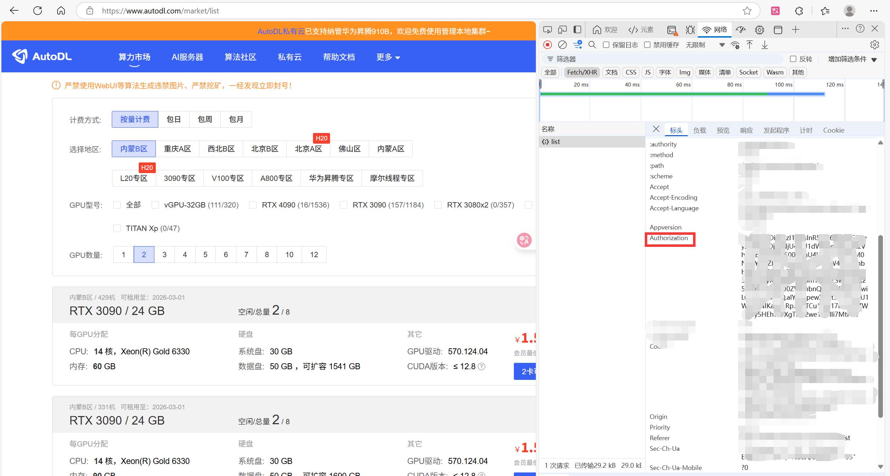
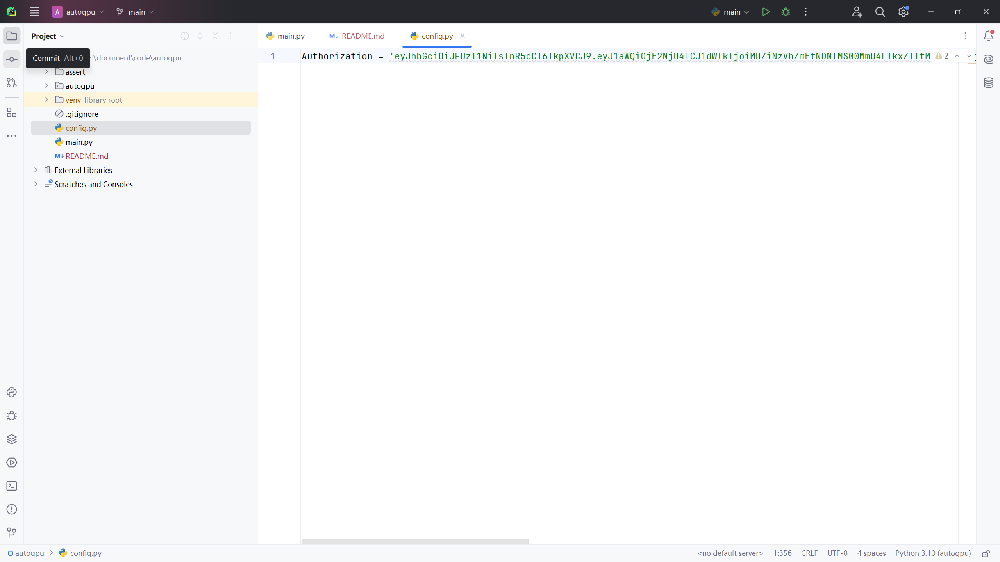

# autogpu
自动监控Autodl的闲置GPU，自动购买Autodl任意闲置GPU

## Usage
1、首先进行登陆自动生成config.py文件，或者按照下面方法去找到Authorization自己编写config.py文件
```python
from autogpu import login

login.login() # 不添加参数，使用wx二维码登陆
login.login(phone = '填写手机号', password = '填写密码') # 使用手机号+密码登陆
```

2、监控
```python
# watch
from autogpu import watch
import config

gpu_info = watch.watch_gpu(config = config, gpu = 'RTX 4090')
print(gpu_info)
```

3、购买
```python
# use
from autogpu import gpu
import config

# pytorch(2.5.1, 2.3.0, 2.1.2, 2.1.0, 2.0.0)
gpu.use(config = config, gpu = 'RTX 3090', pytorch = '2.1.2')
```

# config(Authorization)
- 1、首先登陆Autodl
- 2、点击算力市场任意找一个地区，找到Authorization字段

- 3、创建config.py文件，将字段写入里面
